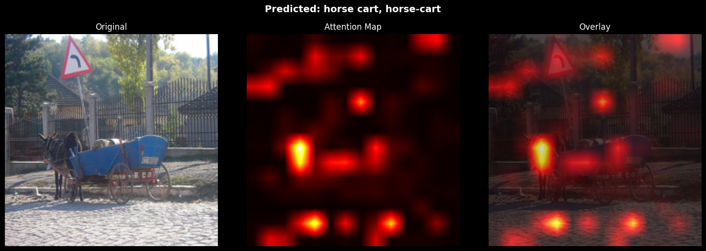
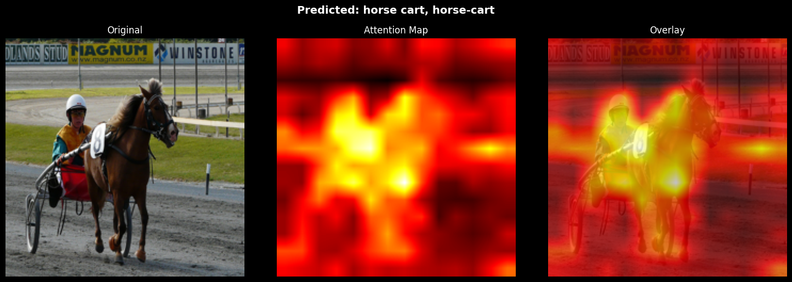
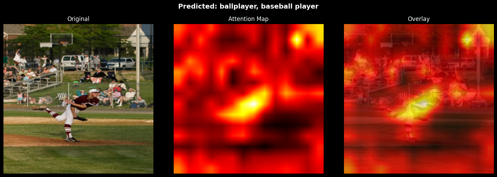
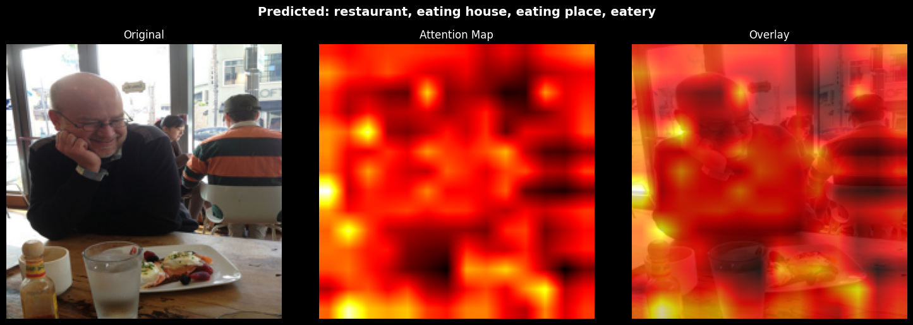
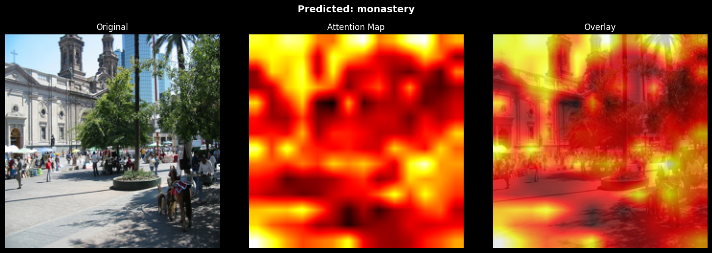

# ViT Attention Visualization

A personal learning project exploring how Vision Transformers (ViT) "see" images by visualizing their attention maps across 100 COCO images spanning 4 categories: cats, horses, cars, and bicycles.

## What I Was Investigating

Vision Transformers treat images as sequences of patches,  a 224×224 image gets divided into a 14×14 grid of 16×16 pixel patches, each becoming a token analogous to a word in a language model. The model uses multi-head self-attention across these 197 tokens (196 patches + 1 CLS token) to form its classification.

The core question: **can we look inside the attention mechanism and understand what the model is actually focusing on when it makes a prediction?**

Two methods were compared:

**Last Layer Attention**:  extract the CLS token's attention weights from the final transformer block only, averaged across all 12 heads. Simple but noisy.

**Attention Rollout**: propagate attention through all 12 layers by multiplying attention matrices sequentially, accounting for residual connections by adding the identity matrix at each step. More faithful to how information actually flows through the network.

## Model

`google/vit-large-patch16-224`:  a large ViT pretrained on ImageNet-1k with 86.6M parameters, 12 layers, 12 attention heads per layer, patch size 16×16, input resolution 224×224.

## Setup

```bash
git clone https://github.com/jayjanii/attention-visualization
cd attention-visualization
uv run marimo edit notebook.py
```

Dependencies are managed with `uv`. The notebook fetches images directly from COCO's servers on demand - no local image storage needed.

## Last Layer Attention

Last layer attention maps were noisy and generally not insightful. Averaging across 12 heads in a single layer mixes signals from heads that specialize in very different things - foreground/background separation, texture, local edges - producing a blurry aggregate that rarely tells a clean story.



Attention rollout proved significantly more useful.

---

## Rollout Attention - Findings

### Horse - Clean Attention, Correct Classification



One of the cleaner results. The model correctly classifies the subject and the attention clearly concentrates on the horse and rider, with the background largely ignored. This is the ideal case - the attention map confirms the model is looking at the right thing for the right reason.

---

### Car — Foreground Bias, Background Miss



The model correctly classifies the foreground subject but misses a car visible in the background. The attention is semi-clean and focused on the primary subject. This reveals a fundamental behavior of this classification setup: the model is optimizing for the dominant subject, not for exhaustive object detection. A car in the background simply isn't what the CLS token learns to attend to.

---

### Car - Reasonable "Failure"



Even as a human, the car in this image is barely visible. The attention map is noisy, but the model lands on one of the salient aspects of the scene. This is less a model failure and more a dataset mismatch - this kind of image would suit a model built for binary detection (does a car exist in this image?) rather than subject classification. A good reminder that evaluation has to account for what task the model was actually trained for.

---

### Bicycle - Surprising Correct Classification



No bicycle is clearly visible in this image, yet the model correctly predicted "monastery" with hotspots concentrated at the top of the image where the towers are. This was the most surprising result - the attention map is landing on a genuinely meaningful part of the scene even without a clean subject, showing the model has learned rich visual features beyond just the labeled category.

---

## Limitations

**ImageNet's vocabulary is quirky.** The model maps to 1000 ImageNet categories which are oddly specific - it knows "sorrel" (a horse color) and "Egyptian cat" but not generic "horse" or "cat." Many predictions that look wrong are actually correct at a finer granularity than expected.

**Averaging heads loses information.** Both methods average across attention heads before visualization. Individual heads often specialize meaningfully - some track foreground/background, others local texture, others global structure. Averaging collapses this into a single signal that can be misleading.

**Last layer attention is shallow.** It only captures what the final layer attends to, ignoring how representations were built up across all 12 layers. Rollout addresses this but introduces its own approximation by assuming attention composes multiplicatively.

**Classification ≠ detection.** This model was trained to identify the primary subject of an image. Expecting it to attend to background objects or handle cluttered scenes is asking it to do something it wasn't designed for. The attention maps reflect this - they optimize for the dominant subject.

**Low resolution attention maps.** The 14×14 patch grid gets bilinearly upsampled to 224×224 for visualization. This smoothing means the attention boundaries are inherently imprecise - a hotspot covers at minimum a 16×16 pixel region.

## What I Learned

- How images become token sequences in ViT (patching, flattening, positional embeddings)
- The role of the CLS token as a learned aggregator that attends across all patches
- How multi-head self-attention works in a vision context — same Q/K/V machinery as language models
- Why residual connections matter and how they're accounted for in attention rollout
- That attention visualization is a useful debugging tool but not a ground truth explanation — it shows correlation between attention and prediction, not causation
